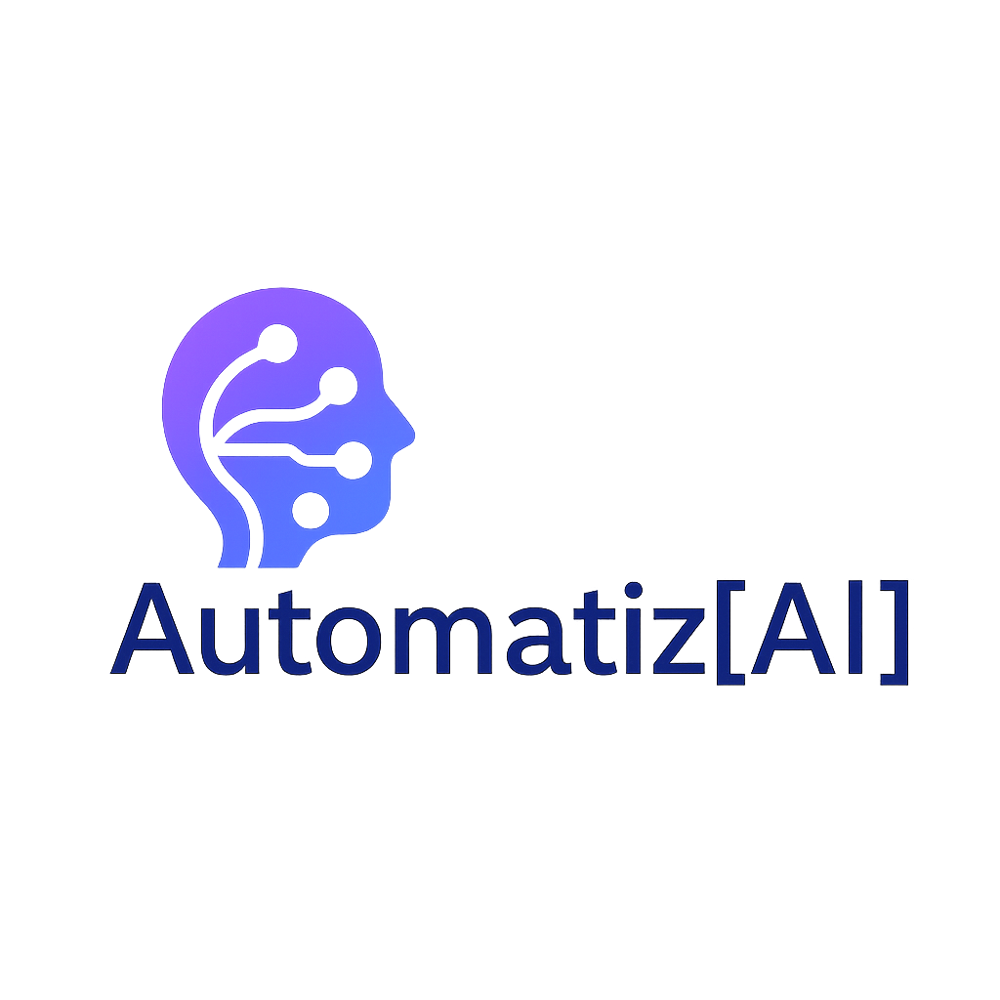

<table border="0" cellspacing="0" cellpadding="10"><tr>
<td valign="middle" width="90"></td>
<td valign="middle">
  <h1>Rafael Lopes</h1>
  
</td>
</tr></table>

 

| | |
|:--|:--|
| **Automação com IA** | CRMs · Chatbots · Integrações |
| **Stack principal** | TypeScript · Node.js · PostgreSQL · Python |
| **Conectando** | CRMs · Agentes de IA · APIs de Mensageria |
| **Foco** | Pipelines que unem dados e times comerciais |

 

<h3 align="left">Conecte-se comigo:</h3>

&nbsp;&nbsp;&nbsp;&nbsp;

 

<h3 align="left">Stack:</h3>

 

 

